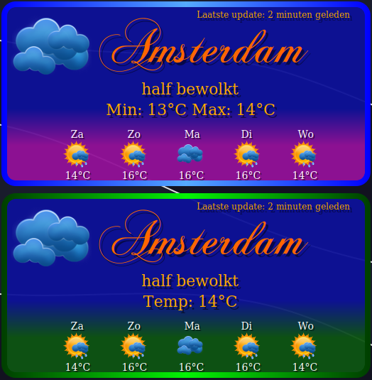
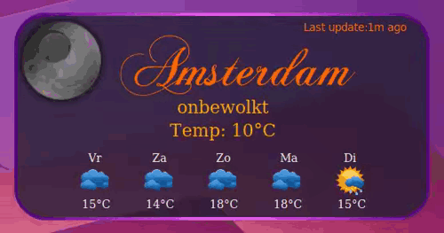

# Conky Weather Widget

A lightweight and customizable weather widget for Conky, written in Lua. This widget fetches real-time weather data from OpenWeatherMap and displays it beautifully on your desktop.

## Weather Widget Preview

 

## Requirements

- **Conky**: Conky must be installed on your system to run the weather display. Refer to [Conky's installation guide](https://github.com/brndnmtthws/conky).
- **Lua**: A Lua interpreter (typically Lua 5.1 or 5.3, depending on your Conky version) is required to process the `settings.lua` configuration and run the `display.lua` script.
- **Cairo**: The script uses the Cairo graphics library for rendering images. Ensure Cairo is installed with PNG support.
  - On some systems, the `cairo-xlib` module is recommended for optimal performance but is optional (the script falls back gracefully if unavailable).
- **jq**: Required for parsing JSON weather data from the OpenWeatherMap API.
- **curl**: Required to fetch weather data from the OpenWeatherMap API.
- **Fonts**: The script uses the `ChopinScript` and `Dejavu Serif` fonts for text rendering. Ensure these are installed on your system.
- **OpenWeatherMap API Key**: You must have a valid API key from [OpenWeatherMap](https://openweathermap.org/) and configure it in `settings.lua`.

### Installation Notes

- On Debian/Ubuntu-based systems, you can install the dependencies with:
  ```bash
  sudo apt-get install conky lua5.1 libcairo2 jq curl fonts-dejavu
  ```
## Features

- Configurable via `settings.lua`: API key, city, units, language, colors, and icon set.
- Optional GUI tools: `WeatherSettingsUpdater` for weather settings, `ConkyColorUpdater` for colors.
- Portable and lightweight, runs via `start.sh`.

## Installation

1. **Clone the repository**:
   ```bash
   git clone https://github.com/wim66/Conky-Weather-and-forecast
   cd conky-weather-lua
   ```

2. **Set up OpenWeatherMap API key**:
   - Sign up at [openweathermap.org](https://openweathermap.org) to get a free API key.

4. **Configure settings**:
   - Edit `settings.lua` for city, units, or colors (see [Configuration](#configuration)).
   - Or use `WeatherSettingsUpdater` and `ConkyColorUpdater` apps.

## Usage

1. **Start the widget**:
   ```bash
   ./start.sh
   ```

2. **Stop Conky**:
   ```bash
   killall conky
   ```

## Configuration

Edit `settings.lua` to customize:

- `API_KEY`: Your OpenWeatherMap key (set via `OWM_API_KEY` environment variable).
- `CITY_ID`: City ID from [openweathermap.org](https://openweathermap.org) (e.g., `2759794` for Amsterdam).
- `UNITS`: `"metric"` (Celsius) or `"imperial"` (Fahrenheit).
- `LANG`: Language for day labels (e.g., `"nl"` for Dutch, `"en"` for English).
- `ICON_SET`: Weather icons (e.g., `"Dark-SagiSan"`, `"Light-vclouds"`). Available in `resources/weather-icons/`.
- `border_COLOR`: Gradient for background border (e.g., `"0,0xff5500,1.00,0.5,0xffd0b9,1.00,1,0xff5500,1.00"`).
- `bg_COLOR`: Background color (e.g., `"0x1d1f30,0.75"`).

Advanced: Adjust background corners in `resources/background.lua` (e.g., `corners = {40, 40, 40, 40}`).

Use `WeatherSettingsUpdater` for `API_KEY`, `CITY_ID`, `UNITS`, `LANG`, `ICON_SET`, or `ConkyColorUpdater` for `border_COLOR`, `bg_COLOR`.

## License

This project is licensed under the MIT License - see the [LICENSE](LICENSE) file for details.